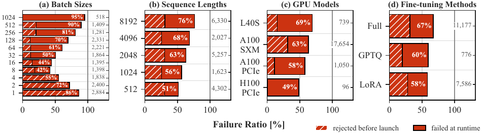
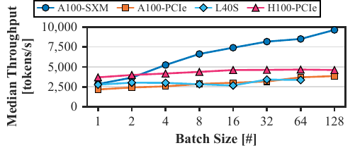
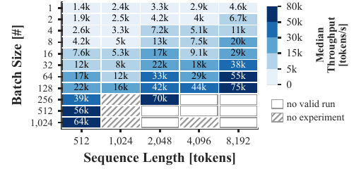
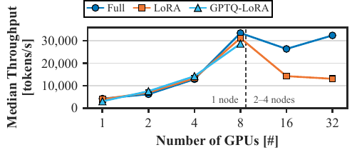
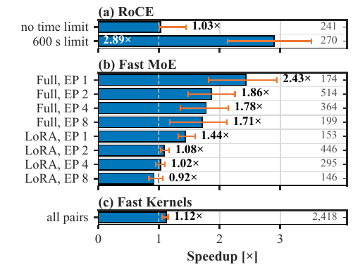

# Artifact Appendix

  

  
  
  
  

*The paper's figures that the capsule regenerates (previews; the full-resolution PDFs go to `out/figures/`).*

## Abstract

This artifact is a small Python capsule that regenerates every dataset-derived number, table and figure of the
paper from the public LLMFineTuningBench dataset (30,920 LLM fine-tuning experiments, on the Hugging Face Hub as
`ibm-research/LLMFineTuningBench`), and checks them against the paper. It needs no GPU: it analyzes the recorded
experiments. One command, `make docker`, builds a container, downloads the dataset, computes all results, and
checks them; without Docker, `make reproducibility` does the same in a local Python virtual environment.

## Artifact check-list (meta-information)

- **Algorithm:** descriptive statistics; matched-pair comparisons (median ratio over pairs of experiments that
  differ only in one factor); weak-scaling efficiency.
- **Program:** Python scripts `reproduce.py`, `figures.py`, `check.py`.
- **Compilation:** none.
- **Transformations:** none.
- **Binary:** none.
- **Model:** none (the capsule trains no model; the dataset records fine-tuning runs of 33 LLMs).
- **Data set:** LLMFineTuningBench, public on the Hugging Face Hub (`ibm-research/LLMFineTuningBench`),
  30,920 rows x 38 columns, downloaded at run time.
- **Run-time environment:** Docker (`python:3.11-slim` image), or Linux/macOS with Python 3.10 or 3.11 and the
  pinned packages of `requirements.txt`.
- **Hardware:** any x86-64 or arm64 machine; no GPU.
- **Run-time state:** none; the run is deterministic.
- **Execution:** `make docker` (or `make reproducibility`).
- **Metrics:** failure ratio [%], throughput [tokens/s], weak-scaling efficiency, speedup [x] over matched pairs.
- **Output:** `out/numbers.json`, `out/table1.txt`, `out/figures/*.pdf`, and the exit status of `check.py`.
- **Experiments:** Table 1 and the analyses of Section 3 (Q1-Q4), with their figures.
- **How much disk space required (approximately)?:** about 0.8 GB (the Docker image); the dataset is a few MB.
- **How much time is needed to prepare workflow (approximately)?:** about one minute (building the image).
- **How much time is needed to complete experiments (approximately)?:** under one minute.
- **Publicly available?:** yes (anonymized for review).
- **Code licenses (if publicly available)?:** set by the authors at publication.
- **Data licenses (if publicly available)?:** Apache-2.0 (the dataset's license on the Hugging Face Hub).
- **Workflow automation framework used?:** GNU Make and Docker.
- **Archived (provide DOI)?:** not yet; a DOI will be provided at publication.

## Description

### How to access

This folder (anonymized for review).

### Hardware dependencies

None beyond a standard laptop, with network access to the Hugging Face Hub.

### Software dependencies

Docker; or Python 3.10 or 3.11 with the exact package versions of `requirements.txt`. `datasets` is pinned to
2.13.2: the dataset card names its only split `all`, a name that `datasets` >= 2.14 rejects.

### Data sets

LLMFineTuningBench, loaded in `reproduce.py` exactly as its card shows, and the only data source:

    from datasets import load_dataset
    ds = load_dataset("ibm-research/LLMFineTuningBench")

`check.py` verifies 30,920 rows x 38 columns and a recorded content hash, so an upstream change fails loudly.

### Models

None.

## Installation

With Docker (recommended), `make docker` builds the image (`docker build -t llm-finetuning-capsule .`) and runs it.
Without Docker, `make reproducibility` creates `.venv/` from `requirements.txt` (use
`make PYTHON=/path/to/python3.11` if Python 3.10 or 3.11 is not on the path).

## Experiment workflow

    make docker            # build the image, then run it as the host user with ./out mounted
    make reproducibility   # the same without Docker: .venv with pinned packages, download, compute, check
    make clean             # remove .venv, out/ and the caches

Both run `reproduce.py` (download the dataset, compute, write `out/`), then `check.py` (compare with the paper).

## Evaluation and expected results

`reproduce.py` writes
- `out/numbers.json`: the dataset's resolved split, shape and content hash; every number with the text the paper
  prints for it (same rounding), with the number of pairs and the interquartile range of matched comparisons; the
  plotted values of each figure;
- `out/table1.txt`: Table 1 and its configuration-space block;
- `out/figures/*.pdf`: the figures, under the paper's file names.

`check.py` exits 0 when
- the data have 30,920 rows x 38 columns and the recorded content hash;
- every number the paper prints (`PAPER`, as the paper prints it) is reproduced with the same text;
- the supporting numbers the paper does not print (`SUPPORT`), and every recorded value, pair count and IQR, are
  unchanged;
- every figure was written by this run with the recorded page size and plotted values.

Otherwise it exits non-zero and lists each difference from the paper.

## Experiment customization

The definitions (outcome, throughput, matched pair, campaigns, weak-scaling efficiency) sit at the top of
`reproduce.py`. A new or restyled figure is one function in `figures.py`, one entry in `FIGURES` in
`reproduce.py`, and its page size and plotted-values hash in `check.py`.

## Notes

- Run `make clean` before sharing this folder: `.venv/` and `.cache/` record absolute paths of the machine.
- The Agg backend of matplotlib is load-bearing: other backends write narrower PDFs than declared.

## Methodology

Submission, reviewing and badging methodology:

- https://www.acm.org/publications/policies/artifact-review-and-badging-current
- https://cTuning.org/ae
